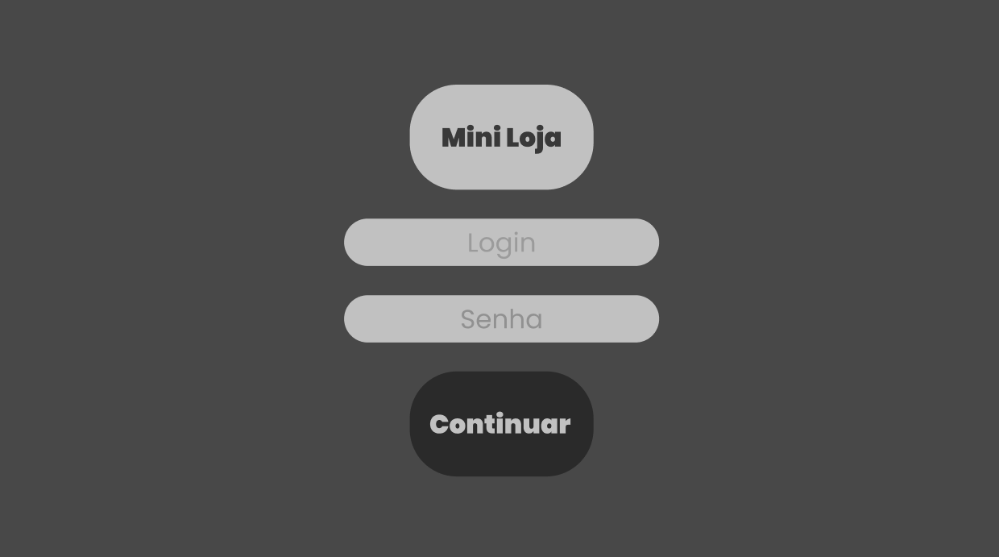

# Cadastro-PHP

Mini Loja
Este é um projeto básico de uma mini loja online, com funcionalidades de login, cadastro de usuários, cadastro de produtos e fornecedores, e carrinho de compras.

Estrutura do Projeto
O projeto contém os seguintes arquivos principais:

index.php: Página de login. Os usuários podem fazer login usando um email e senha cadastrados previamente.
cadastro.php: Página de cadastro de novos usuários. Os usuários podem se cadastrar fornecendo um nome, email e senha.
inicio.php: Página principal da loja após o login, onde os usuários podem visualizar produtos disponíveis e adicioná-los ao carrinho.
inserir.php: Página para cadastrar novos produtos e fornecedores.
Requisitos
Para executar o projeto localmente, é necessário:

Um servidor web (por exemplo, Apache).
PHP instalado.
Banco de dados MySQL.
Configuração
Clone o repositório para o seu ambiente de desenvolvimento.
Importe o arquivo login.sql.zip para criar o banco de dados e as tabelas necessárias.
Inicie o servidor web e acesse o projeto no navegador.

Prototipo Figma

